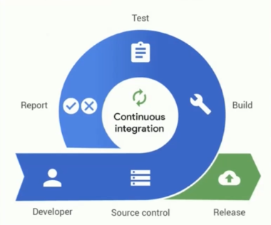

# Hi there

### Branchs:
- 1-exercise:structure yaml file.
- 2-exercise: ci/cd.

Github actions context:

- [github-actions](https://docs.github.com/en/actions/writing-workflows/choosing-what-your-workflow-does/accessing-contextual-information-about-workflow-runs)
- [marketplace](https://github.com/marketplace)
- [github actions artefactory](https://docs.github.com/en/actions/writing-workflows/choosing-what-your-workflow-does/storing-and-sharing-data-from-a-workflow)

### ci/cd continuous integration / continuous deployment

CI/CD, which stands for Continuous Integration and Continuous Delivery/Deployment, is a set of practices that automate the process of building, testing, and deploying software. It aims to streamline the software development lifecycle by integrating code changes frequently, testing them automatically, and delivering updates to users more reliably and quickly. 

### continuous integration.

This involves developers frequently merging their code changes into a shared repository. Automated builds and tests are triggered on each integration, helping to catch errors early and ensure code quality.

### Continuous Delivery (CD) / Continuous Deployment (CD)

- CD automates the delivery of code changes to various environments, including testing and staging, and potentially production.

- It ensures that the software is always in a deployable state, ready for release.

- Continuous Deployment goes a step further, automatically deploying changes to production without manual intervention.

- Continuous Delivery may involve manual approval before deployment to production.

